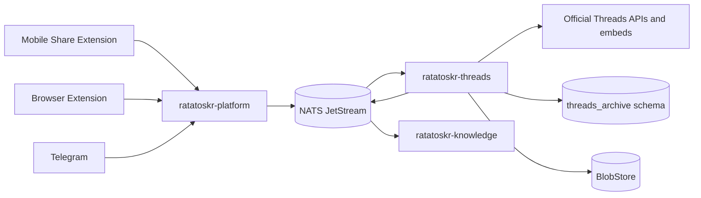
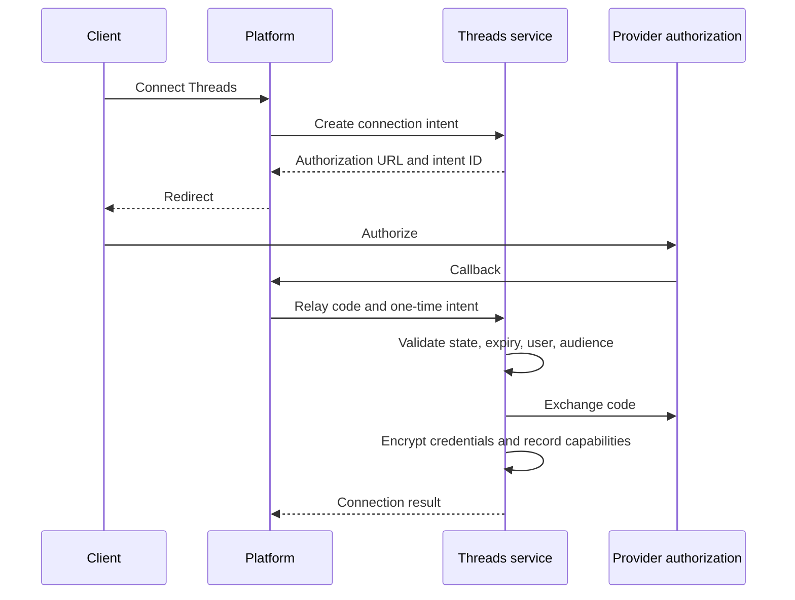
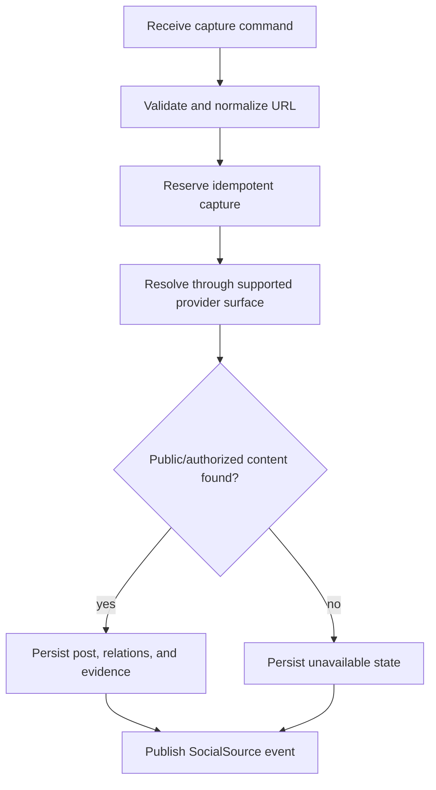

# Ratatoskr Threads Architecture

> Status: target architecture. This repository is in architecture bootstrap. Provider capabilities are versioned runtime facts and must be verified against the official Threads API during implementation.

## 1. Purpose

`ratatoskr-threads` archives Threads content through supported account APIs, explicit user captures, public embed resolution, and safe Data Export imports.

The service has two separate acquisition lanes:

1. **Official account lane** — user-authorized account identity, own posts/replies, and other explicitly granted capabilities.
2. **Explicit capture lane** — user-initiated preservation of a public Threads post through mobile, browser, Telegram, or another Ratatoskr client.

A local capture records a Ratatoskr save. It does not claim authoritative membership in the native Threads Saved list unless an official API later provides that state.

The service never stores provider passwords or browser cookies and does not use hidden web endpoints or stealth browser automation.

## 2. Architectural position



Platform owns public authentication and operations. Threads owns provider-specific authorization, source resolution, account synchronization, and import semantics.

## 3. Repository structure

```text
ratatoskr-threads/
├── crates/
│   ├── threads-domain/
│   ├── accounts/
│   ├── oauth/
│   ├── posts/
│   ├── relations/
│   ├── captures/
│   ├── public-resolution/
│   ├── media/
│   ├── data-export/
│   ├── provider-client/
│   ├── persistence/
│   ├── eventing/
│   ├── telemetry/
│   └── test-support/
├── services/
│   └── threads/
├── schema/
├── fixtures/
│   ├── captures/
│   └── data-exports/
├── tests/
└── docs/
```

Account synchronization, public capture resolution, and Data Export import remain separate adapters with separate authority and failure models.

## 4. Bounded context and data ownership

Recommended schema:

```text
threads_archive.accounts
threads_archive.credentials
threads_archive.account_capabilities
threads_archive.posts
threads_archive.post_revisions
threads_archive.post_relations
threads_archive.media
threads_archive.captures
threads_archive.capture_attempts
threads_archive.public_resolutions
threads_archive.data_exports
threads_archive.import_runs
threads_archive.import_records
threads_archive.unavailable_sources
threads_archive.outbox
threads_archive.inbox
```

The service owns Threads-specific provider records and provenance. It does not own global user identity, local collections, generic article documents, summaries, embeddings, or client-side queues.

## 5. Provenance and authority

Every object records acquisition method and authority.

```text
acquisition:
  OfficialApi
  ShareExtension
  BrowserExtension
  TelegramCapture
  DataExport
  LegacyImport

saved_authority:
  ExplicitUserCapture
  ExportObservation
  ProviderAccountObservation
  LegacyObservation
```

`AuthoritativePlatformState` is reserved for a future supported API that explicitly exposes native Saved state. It is not inferred from a capture URL or export category name.

### 5.1. Capture meaning

A capture proves:

- the user explicitly asked Ratatoskr to preserve a Threads URL;
- the capture time, client, note, and requested local organization;
- the provider resolution result at that moment.

It does not prove:

- the user saved it natively in Threads;
- the source remains public;
- the author intended redistribution;
- a later unavailable result equals deletion.

## 6. Official account lane

### 6.1. Capability model

The service records capabilities actually available for a connected account/application.

Potential capability families:

```text
account identity
own post listing
own replies
mentions/interactions
publishing
insights
```

Features are enabled through recorded capabilities, not plan names or hard-coded assumptions.

### 6.2. OAuth architecture

Platform can host the public callback facade, while Threads owns:

- one-time authorization intent;
- state, nonce, expiry, and internal-user binding;
- provider code exchange;
- encrypted credential storage and refresh;
- granted scopes and capability projection;
- revocation and reauthorization state.



### 6.3. Account synchronization

Account sync observes own posts and relations available through the API.

Rules:

- stable provider IDs are primary external identity;
- handle/display names are mutable observations;
- provider timestamps are preserved separately from local observations;
- pagination checkpoints are explicit;
- partial listings do not prove removal;
- a provider capability loss is distinct from post deletion.
- a missing own-content capability is a no-op, not a failed or fabricated sync;
- an official observation can raise only its matching own post/reply to `authoritative_platform_state` and never proves native Saved membership.

## 7. Threads post model

A normalized provider post includes:

```text
external_post_id
account/author reference
canonical URL
text
published_at
observed_at
content hash
raw provider blob reference
upstream status
media references
```

### 7.1. Relations

Threads relationships are explicit edges:

```text
reply_to
quotes
reposts
part_of_thread
```

Unresolved parent/quoted posts remain references with availability state rather than being discarded.

### 7.2. Revisions

Changed text or metadata creates an observation/revision. The current projection can change while prior evidence remains available according to retention policy.

### 7.3. Thread assembly

A thread view is a derived graph traversal, not a duplicated monolithic text record. It may be partial when parents or replies are unavailable.

## 8. Explicit capture lane

### 8.1. Capture command

```text
owner_user_id
original URL
captured_at
capture source
client/device reference
idempotency key
optional note
optional local collection/tag intents
optional user-provided attachments
```

The service accepts only recognized Threads URL families and normalizes short/canonical variants safely.

### 8.2. Processing flow



Long resolution executes asynchronously under a Platform operation.

### 8.3. Multiple captures

Multiple users or repeated intentional captures can refer to one provider post. Provider object deduplication does not erase user-specific note, timestamp, or local organization intent.

## 9. Public resolution and embeds

Supported public resolution may use official embed/oEmbed or API surfaces.

A resolution result may include:

- provider post ID;
- canonical permalink;
- public author metadata;
- text;
- publication timestamp;
- reply/quote relation hints;
- media/embed metadata;
- provider response/blob reference;
- resolution timestamp and resolver version.

The resolver is not a general web scraper. Login barriers, private posts, or unsupported URLs become explicit unavailable states.

## 10. Unavailable, private, and access-lost content

Possible states:

```text
available_public
available_authorized_account
private
login_required
removed
unsupported
access_lost
account_restricted
unknown
```

Rules:

- do not bypass privacy controls;
- preserve original capture evidence and user note;
- distinguish private/access loss from deletion;
- never leak previously authorized private content to another user;
- user-supplied screenshots/files use separate `UserProvided` provenance;
- revalidation updates current status without rewriting historical capture facts.

## 11. Media architecture

Media metadata can include:

```text
provider media ID
media type
width and height
duration
alt/accessibility text
preview observation
carousel/attachment order
local blob reference
```

Local media storage is policy-driven and allowed only through supported provider delivery or explicit user upload. Temporary remote URLs are observations, not durable backup evidence.

Media passes MIME, size, decompression, and hash validation before BlobStore persistence.

## 12. Data Export architecture

### 12.1. Raw-first pipeline

```text
receive official archive
-> stream hash
-> store immutable raw archive
-> safely inspect container
-> detect provider/schema version
-> extract in isolated directory
-> run versioned parser into staging
-> validate relationships and assets
-> reconcile provider records
-> produce completeness report
-> publish events
```

### 12.2. Archive safety

- reject absolute paths and traversal;
- limit files and decompressed bytes;
- detect archive bombs;
- sniff MIME;
- never execute or render active content;
- preserve unknown sections/files;
- derive storage keys from content hashes.

### 12.3. Versioned parsing

The parser never assumes one permanent export layout. It records detected schema, parser version, unknown record variants, missing references, and warnings.

### 12.4. Completeness

Reports include:

```text
known categories parsed
unknown categories preserved
posts/replies resolved
attachments present/missing
saved-like observations present/absent
relationship gaps
schema confidence
warnings
```

Absence in one export cannot mark existing local objects deleted unless the export format explicitly provides authoritative deletion semantics.

## 13. Normalized SocialSource

The shared output includes:

```text
platform = Threads
external_id
canonical_url
acquisition
saved_authority
author
published_at
captured_at
text
media
reply/quote/repost relations
raw_blob_ref
content_hash
upstream_status
```

Native provider relationships are preserved. Ratatoskr-local collections remain external references managed through Platform/client workflows.

## 14. Deduplication and revisions

Deduplication priority:

1. provider post ID;
2. verified canonical URL;
3. content hash plus author/publication evidence;
4. command idempotency key.

Deduplicated provider objects can have multiple capture records and acquisition observations.

A revision never overwrites the raw response or capture evidence that produced the previous state.

## 15. Provider publishing and writes

Publishing or other account mutations are optional capabilities and require:

- explicit write scope and consent;
- user-authored content and confirmation;
- idempotency;
- audit record;
- provider capability check;
- partial-success reporting;
- no triggering from LLM analysis or captured source instructions.

Write features are not prerequisites for archive/read capabilities.

## 16. Commands and events

### 16.1. Commands consumed

```text
threads.account.connect_requested.v1
threads.account.sync_requested.v1
threads.capture.requested.v1
threads.source.revalidate_requested.v1
threads.data_export.import_requested.v1
threads.post.publish_requested.v1
```

### 16.2. Events emitted

```text
threads.account.connected.v1
threads.account.reauth_required.v1
threads.post.observed.v1
threads.capture.resolved.v1
threads.capture.unavailable.v1
threads.data_export.ingested.v1
threads.data_export.partial.v1
threads.post.published.v1
social.source.upserted.v1
social.source.unavailable.v1
```

Large provider responses and media remain in BlobStore; events carry references and bounded metadata.

## 17. Persistence and transactions

Transactions group:

- capture reservation;
- post/relation observations;
- import staging/reconciliation state;
- current projections;
- outbox records.

Provider and BlobStore operations occur outside transactions. Durable states make retry and interruption recovery explicit.

At-least-once delivery is handled through inbox deduplication and idempotent command identity.

## 18. Failure model

### Transient

- provider timeout or throttling;
- temporary token refresh failure;
- database, event-bus, or BlobStore outage.

### Action-required

- revoked credentials;
- removed scopes/capabilities;
- unsupported account type for requested action;
- private/login-required content.

### Permanent for one input

- malformed or unsupported URL;
- content unavailable through supported surfaces;
- invalid archive or media exceeding policy;
- unsupported provider export version with no safe generic preservation path.

An unavailable capture can still be a successfully archived intent with warnings.

## 19. Security boundaries

- No password, cookie, hidden endpoint, or browser-session automation.
- Credentials are encrypted and service-local.
- OAuth state and callback user binding are one-time and validated.
- URLs, embeds, media, and archives are hostile input.
- Private content access is checked against the owning user/account.
- Active HTML is not executed during import.
- Provider writes require explicit consent and cannot be model-triggered.
- Logs/events exclude tokens, private post content, raw exports, and signed media URLs.
- User-provided artifacts are labelled separately.
- Knowledge receives normalized records, not credentials.

## 20. Rate limits and capability evolution

The service tracks endpoint limits, reset windows, throttling signals, provider request IDs, and capability versions.

Priority:

1. explicit capture or publish operation;
2. user-triggered account refresh;
3. incomplete import/revalidation recovery;
4. scheduled background account sync.

A capability disappearing changes account capability state and public feature availability. It does not delete existing archived records.

## 21. Observability

Required telemetry:

```text
threads_api_requests_total
threads_api_latency_seconds
threads_capture_requests_total
threads_capture_results_total
threads_account_sync_duration_seconds
threads_post_observations_total
threads_relation_resolution_failures_total
threads_reauth_required_total
threads_export_import_duration_seconds
threads_export_unknown_records_total
threads_export_missing_assets_total
threads_media_bytes_stored
queue_lag_seconds
```

Raw URLs, handles, text, and post IDs are excluded from unbounded metric labels.

## 22. Testing architecture

### Unit

- URL normalization and recognition;
- provenance/authority classification;
- post graph and relation handling;
- capture idempotency;
- provider object deduplication/revisions;
- capability decisions;
- availability transitions;
- export schema detection.

### Integration

- OAuth and encrypted credential lifecycle;
- fake official provider/embed surfaces;
- SQL schema initialization and transactions;
- BlobStore raw export/media flow;
- outbox/inbox replay;
- interrupted account sync and import recovery.

### Adversarial

- malformed/ambiguous URLs;
- private/login responses;
- archive traversal/bombs;
- oversized media;
- active HTML/script payloads;
- unknown provider response/export variants;
- access loss after prior observation.

### Planned workspace end-to-end

- explicit mobile/browser/Telegram capture;
- post/relation resolution and SocialSource indexing;
- unavailable capture projection;
- authorized own-post sync;
- Data Export import and completeness report;
- Knowledge search and Platform progress.

## 23. Deployment architecture

Runtime roles may include:

```text
OAuth/internal handlers
explicit capture resolver
account sync consumer
Data Export import worker
revalidation worker
optional publishing consumer
```

They may share one image but use separate concurrency and NATS permissions.

Dependencies:

- PostgreSQL `threads_archive` role;
- NATS JetStream;
- secret encryption backend;
- official Threads API/embed access;
- BlobStore.

No Chromium, provider browser profile, Git CLI, or direct Knowledge database access is required.

## 24. Migration architecture

Legacy Threads captures are imported with explicit non-authoritative provenance.

1. Preserve original URL, time, note, files, and raw metadata.
2. Normalize recognized URL forms.
3. Resolve through supported current provider surfaces.
4. Keep unresolved captures as valid archive records.
5. Deduplicate provider posts while retaining capture intents.
6. Build relation graphs and SocialSource projections.
7. Reindex through Knowledge.
8. Never reinterpret legacy capture as native Saved state.

## 25. Architectural invariants

1. Official account and explicit capture are separate lanes.
2. A capture proves a Ratatoskr save, not native Threads Saved membership.
3. Acquisition and saved authority are mandatory.
4. Provider credentials remain inside this service.
5. No provider password, cookie, hidden API, or stealth browser synchronization is used.
6. Post relations are explicit graph edges.
7. Public resolution uses supported provider surfaces.
8. Private/unavailable content is recorded truthfully and never bypassed.
9. User-provided media is distinct from provider-derived media.
10. Raw Data Export archives are preserved before parsing.
11. Unknown export records are retained.
12. Missing export categories do not prove deletion.
13. Provider writes require separate explicit consent.
14. Analysis is delegated to Knowledge.
15. Delivery is at-least-once and handlers are idempotent.

## 26. Evolution

Initial milestones:

1. URL, post, relation, capture, and provenance foundations.
2. Public resolver and unavailable-state handling.
3. SocialSource events and Knowledge integration.
4. Account OAuth with capability recording.
5. Own-post/reply observations where supported.
6. Raw-first Data Export intake and versioned parser.
7. Completeness reports and unknown-record preservation.
8. Optional publishing behind separate write consent.
9. Revalidation, rate-limit budgets, and runbooks.
10. Legacy capture migration.

Changes to acquisition authority, provider-session policy, post-relation semantics, or private-content handling require ADRs and coordinated workspace changesets.
